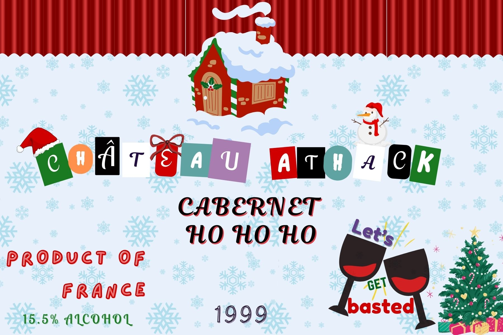
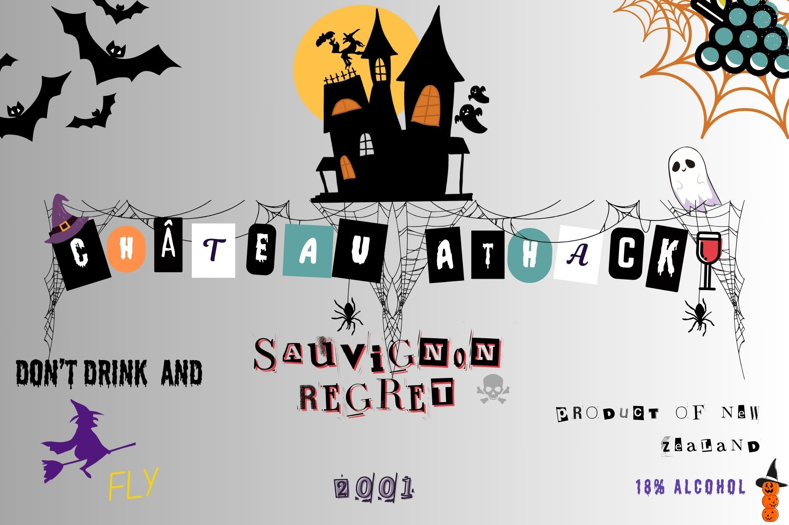
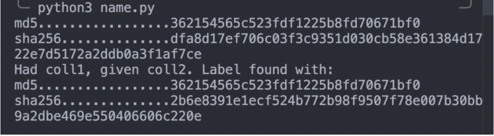

# Alcohollisions WriteUp

- Cryptography

## Description

Professor Gilbert Winestein is a renowned cybersecurity expert... and an even bigger wine enthusiast! His prized wine collection features exclusive bottles from the renowned vineyard Château AtHack. Every time he adds a new bottle, he struggles to check if it’s already in his collection because comparing all the labels takes forever. To speed up the process, Winestein's friends suggested a clever hack: record the MD5 hash of each label. Since MD5 hashes are short, it would make his collection faster to manage.

But you, a sharp and curious student of his, notice a potential flaw. What if two labels from different bottles accidentally produce the same MD5 hash? Winestein might think they’re duplicates and toss out a unique wine!

To convince him, you decide to demonstrate how two different labels can have the same MD5 hash but different SHA-256 hashes. Use this information to teach him why relying on MD5 alone might not be the best choice for such a prized collection.

## Attachment





- Labels are made with Canva by LittleSquid

## Solution

(1) The participant must first identify the image which was created by a collision attack. Figure this out by looking into collision attacks (of which there are only 3 popular ones)- and notice 128 bytes of garbage at the end of EasterLabel.jpg file. (The garbage is preceded with “1010101…” which is padding. Adding of the padding makes the 128 bytes more obvious.) Once the participant knows it is the EasterLabel.jpg, they can run python script on it.

(2) Run the script

```py

    import hashlib # for using md5, sha256

    with open("collision1.jpg", "rb") as f1: #rb=reading bytes #c1 = collision1
    c1 = bytearray(f1.read()) #to write line 19
    original_md5_hash = hashlib.md5(c1).hexdigest() #hexdigest gives u string
    original_sha256_hash = hashlib.sha256(c1).hexdigest()
    print(f'{"md5":.<20}{original_md5_hash:>20}')
    print(f'{"sha256":.<20}{original_sha256_hash:>20}')

    # g1 = guess1 (assuming it's coll1 and looking for coll2)
    g1 = c1.copy()
    g1_size = len(g1)
    g1_block_start = g1_size - 128

    # Increment the 10th, and decrement the 74th byte of the "garbage" block
    g1[g1_block_start + 10 - 1] += 1
    g1[g1_block_start + 64 + 10 - 1] -= 1

    g1_md5 = hashlib.md5(g1).hexdigest()
    g1_sha256 = hashlib.sha256(g1).hexdigest()

    # g2 = guess2 (assuming it's coll2 and looking for coll1)
    g2 = c1.copy()
    g2_size = len(g2)
    g2_block_start = g2_size - 128

    # Increment the 10th, and decrement the 74th byte of the "garbage" block
    g2[g2_block_start + 10 - 1] -= 1
    g2[g2_block_start + 64 + 10 - 1] += 1

    g2_md5 = hashlib.md5(g2).hexdigest()
    g2_sha256 = hashlib.sha256(g2).hexdigest()

    if original_md5_hash == g1_md5:
        # We were given coll1, got collision2
        print("Had coll1, given coll2. Label found with:")
        print(f'{"md5":.<20}{g1_md5:>20}')
        print(f'{"sha256":.<20}{g1_sha256:>20}')
        with open("guess.jpg", "wb+") as f:
            f.write(g1)
        raise SystemExit(0)
    elif original_md5_hash == g2_md5:
        # We were given coll2, got collision1
        print("Had coll2, given coll1. Label found with:")
        print(f'{"md5":.<20}{g2_md5:>20}')
        print(f'{"sha256":.<20}{g2_sha256:>20}')
        with open("guess.jpg", "wb+") as f:
            f.write(g2)
        raise SystemExit(0)
    else:
        print("HUH?!")
        raise SystemExit(1)

```

(3) After running the python script, you will find the collision image with same md5.



(4) Upload another EasterLabel image (same md5 but different sha256) and you will get the flag!

## Flag

ATHACKCTF{y0uar3aSharpStud3nt}
